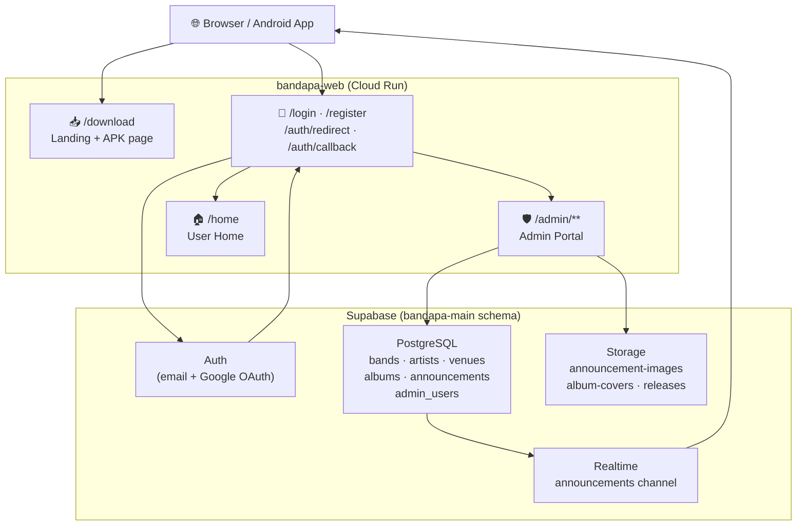

<div align="center">


# bandapa-web

**The web companion to the Bandapa Android app.**  
Admin portal · APK distribution · Email auth · Real-time announcements

[](https://nextjs.org)
[](https://supabase.com)
[](https://www.typescriptlang.org)
[](https://tailwindcss.com)
[](https://cloud.google.com/run)
[](LICENSE)

[**Live Site**](https://bandapa-web-953816367167.asia-southeast1.run.app) · [**Android App**](#related-applications)

</div>

---

## What is this?

`bandapa-web` is the web service powering everything behind the **Bandapa** live-music ecosystem. It handles what the Android app cannot do on its own — verifying accounts, distributing APK builds, managing platform data, and broadcasting announcements in real time.

```diff
+ Full admin dashboard  →  manage bands, artists, venues, albums, announcements
+ Public download page  →  APK distribution with install guide
+ Auth flows            →  email verification, Google OAuth, role-based routing
+ Realtime bridge       →  announcements written here appear in the Android app instantly
```

---

## Architecture



---

## Features

### 🛡️ Admin Dashboard

A full CRUD management portal restricted to users in the `admin_users` table. Access is enforced at two layers: middleware (JWT check) and layout (service-role DB check).

| Resource | Operations |
|---|---|
| **Bands** | Create · Edit · Delete · search |
| **Artists** | Create · Edit · Delete · photo upload |
| **Venues** | Create · Edit · Delete · Google Maps autocomplete · auto lat/lng |
| **Albums** | Create · Edit · Delete · track list · cover upload |
| **Announcements** | Create · Edit · Delete · activate/deactivate · image upload |

> **Venues** use the **Google Maps Places API** — start typing an address and the field autocompletes, drops a pin on the live map widget, and fills latitude/longitude automatically.

---

### 📢 Announcements & Realtime

Announcements written in the admin portal are stored in Supabase and pushed over **Supabase Realtime** to every connected Android client. Active announcements appear as in-app notifications; deactivating one removes it from all connected devices without a new build.

Each announcement supports an optional **image** stored in the `announcement-images` Supabase Storage bucket. Images are uploaded from the browser, stored publicly, and deleted automatically when an announcement is deleted.

---

### 🔐 Authentication

```
Email/password  ──┐
                  ├──► /auth/redirect ──► /admin  (if admin_users row exists)
Google OAuth    ──┘                  └──► /home   (regular users)
                        ▲
                /auth/callback (OAuth code exchange)
```

- **Google OAuth** — `signInWithOAuth` → Supabase → `/auth/callback` → `/auth/redirect`
- **Email/password** — standard Supabase auth, same final routing
- **Email confirmation** — `/auth/confirm` handles Supabase magic-link redirects
- **Admin detection** — uses the Supabase **service role** client to bypass RLS on `admin_users`
- **Cloud Run fix** — `/auth/callback` reads `x-forwarded-host` to build the correct redirect URL (Cloud Run internal socket is `0.0.0.0:8080`)

---

### 📦 APK Distribution

`/download` is a public marketing page with:
- One-click APK download from Supabase Storage
- Step-by-step sideload guide (enable unknown sources → download → install)
- Animated particle-network hero (Canvas 2D, 115 nodes, mouse-reactive)
- Nav reflects signed-in state — admins see an **Admin Dashboard** shortcut

---

### 🎨 Design System — Eco-Systemic Modernism

| Token | Value | Role |
|---|---|---|
| `chlorophyll-green` | `#6EE384` | Primary accent, buttons, badges |
| `obsidian-deep` | `#0F1509` | Backgrounds, text, sidebar |
| `primary` | `#006e2d` | Forest green, links, borders |
| Font — Headline | Plus Jakarta Sans | Headings |
| Font — Body | Inter | Prose |
| Font — Mono | JetBrains Mono | Labels, badges, code |

All dark auth pages (`/login`, `/register`, `/auth/confirm`) render a **WebGL GLSL simplex-noise shader** background (half-resolution, CSS upscaled). The `/download` hero uses a **Canvas 2D particle network**.

Spring physics are implemented in pure CSS keyframes — `@keyframes spring-row-in` with a 4-step overshoot-and-settle pattern used on all admin tables.

---

## Project Structure

```
bandapa-web/
├── app/
│   ├── admin/            # Protected admin portal (layout + 5 resource pages)
│   ├── auth/             # confirm · callback · redirect
│   ├── download/         # Public APK landing page
│   ├── home/             # Authenticated user home
│   ├── login/            # Email + Google OAuth sign-in
│   └── register/         # New account registration
├── components/
│   ├── AddressAutocomplete.tsx   # Google Maps Places + map widget
│   ├── AdminSidebar.tsx          # Dark sidebar with staggered nav
│   ├── LandingNav.tsx            # Public nav (auth-aware)
│   ├── Modal.tsx                 # Portal modal with spring animation
│   ├── ParticleNetwork.tsx       # Canvas 2D particle system
│   ├── ScrollReveal.tsx          # Intersection Observer reveal
│   ├── SignOutButton.tsx          # Client-side sign-out
│   └── WebGLNoise.tsx            # Raw WebGL GLSL noise shader
├── lib/
│   ├── supabase/
│   │   ├── client.ts    # Browser Supabase client
│   │   └── server.ts    # Server + admin (service-role) clients
│   └── types.ts         # Shared TypeScript interfaces
├── public/static/        # App icons (served by Next.js)
├── middleware.ts          # JWT route protection
└── Dockerfile            # Multi-stage, standalone Next.js output
```

---

## Getting Started

### Prerequisites

- Node.js 20+
- A [Supabase](https://supabase.com) project with schema `bandapa-main`
- A Google Cloud project with **Maps JavaScript API** + **Places API** enabled
- (For deployment) Google Cloud SDK + Docker

### Local Setup

```bash
# 1. Clone
git clone https://github.com/rgmc-apps/bandapa-web.git
cd bandapa-web

# 2. Install
npm install

# 3. Configure env
cp .env.example .env.local   # then fill in values (see below)

# 4. Run
npm run dev
```

### Environment Variables

```env
# Supabase (public — safe to expose)
NEXT_PUBLIC_SUPABASE_URL=https://<ref>.supabase.co
NEXT_PUBLIC_SUPABASE_ANON_KEY=eyJ...

# Supabase service role (server-only — never expose to client)
SUPABASE_SERVICE_ROLE_KEY=eyJ...

# APK download URL (Supabase Storage public URL)
NEXT_PUBLIC_APK_DOWNLOAD_URL=https://<ref>.supabase.co/storage/v1/object/public/releases/bandapa-latest.apk

# Google Maps (enable: Maps JavaScript API + Places API)
NEXT_PUBLIC_GOOGLE_MAPS_API_KEY=AIza...

# Public site URL (used for auth redirects)
NEXT_PUBLIC_SITE_URL=http://localhost:3000
```

### Supabase Setup

1. Create schema `bandapa-main`
2. Expose it: **Dashboard → Settings → API → Exposed schemas** → add `bandapa-main`
3. Grant access:

```sql
GRANT USAGE ON SCHEMA "bandapa-main" TO postgres, anon, authenticated, service_role;
GRANT ALL ON ALL TABLES IN SCHEMA "bandapa-main" TO postgres, anon, authenticated, service_role;
ALTER DEFAULT PRIVILEGES IN SCHEMA "bandapa-main"
  GRANT ALL ON TABLES TO postgres, anon, authenticated, service_role;
```

4. Seed your first admin:

```sql
INSERT INTO "bandapa-main".admin_users (user_id)
VALUES ('<your-auth-user-uuid>');
```

---

## Deployment (Google Cloud Run)

```bash
# Build
docker build \
  --build-arg NEXT_PUBLIC_GOOGLE_MAPS_API_KEY=AIza... \
  -t gcr.io/<PROJECT_ID>/bandapa-web .

# Push
docker push gcr.io/<PROJECT_ID>/bandapa-web

# Deploy
gcloud run deploy bandapa-web \
  --image gcr.io/<PROJECT_ID>/bandapa-web \
  --platform managed \
  --region asia-southeast1 \
  --allow-unauthenticated \
  --set-env-vars="SUPABASE_SERVICE_ROLE_KEY=eyJ..."
```

> **Note:** `SUPABASE_SERVICE_ROLE_KEY` must be injected at runtime — never baked into the image.

---

## Related Applications

<table>
<tr>
<td align="center" width="160">
  <b>Bandapa Android</b><br/>
  <sub>The mobile app this service supports. Manages bands, gigs, venues, and receives realtime announcements via Supabase.</sub>
</td>
<td align="center" width="160">
  <b>Supabase</b><br/>
  <sub>PostgreSQL database, auth provider (email + Google OAuth), file storage, and realtime engine.</sub>
</td>
<td align="center" width="160">
  <b>Google Maps</b><br/>
  <sub>Places Autocomplete and map widget used in the venue editor for address search and coordinate selection.</sub>
</td>
</tr>
</table>

---

## Tech Stack

| Layer | Technology |
|---|---|
| Framework | Next.js 15 (App Router, standalone output) |
| Language | TypeScript 5 |
| Styling | Tailwind CSS v4 |
| Auth + DB | Supabase (PostgreSQL, RLS, Realtime) |
| Storage | Supabase Storage |
| Maps | Google Maps JavaScript API + Places |
| Deployment | Docker → Google Cloud Run |
| Animations | CSS keyframes · WebGL GLSL · Canvas 2D |

---

<div align="center">
  <sub>Built with the <strong>Eco-Systemic Modernism</strong> design language · Chlorophyll Green meets Obsidian Deep</sub><br/>
  <sub>© 2025 Bandapa · <a href="https://bandapa-web-953816367167.asia-southeast1.run.app">bandapa-web-953816367167.asia-southeast1.run.app</a></sub>
</div>
